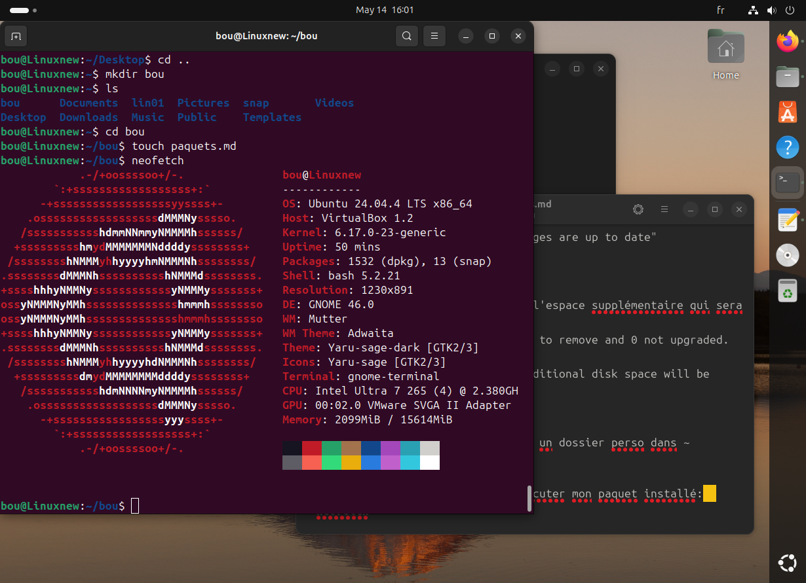

# Installation de neofetch: 
## Étapes et commentaire:
---
**sudo apt upgrade**  
J'ai la confirmation que "all packages are up to date"

**sudo apt install neofetch**    
Demande mon mdp  
puis aussi à vérifier et confirmer l'espace supplémentaire qui sera utilisé dans le disque  
> 0 upgraded, 37 newly installed, 0 to remove and 0 not upgraded.  
Need to get 16.2 MB of archives.  
After this operation, 57.1 MB of additional disk space will be used.  
Do you want to continue? (Y/n] Y

Ensuite je créee mon ficher MD dans un dossier perso dans ~
pour documenter ces tâches.  

là je peux procéder à lancer et exécuter mon paquet installé:  
**neofetch**  

