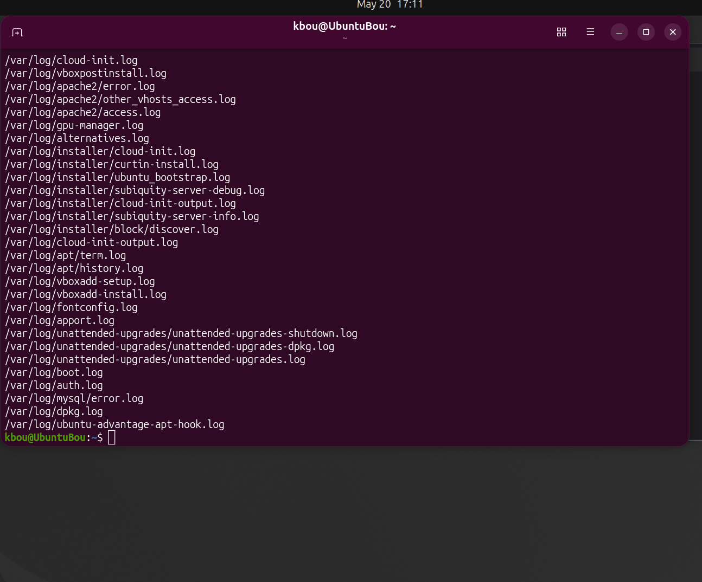
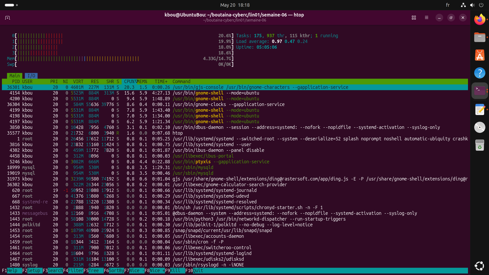

#Mission 01
##Commande grep (grep -i "erreur" journal-sys.log) et find (find /var/log -name "*.log"
  
--
#Mission 02
--
##Exécution de ps aux et identification des 3 processus qui consomment le plus de CPU
--
>ps aux --sort=-%cpu | head -n 4
>nano rapport-semaine-6.md  
--
USER        PID    %CPU    %MEM    VSZ     RSS   TTY    STAT START   TIME COMMAND
**kbou**    4154  **3.7**   5.6   5553812  866092  ?      Ssl  13:14  10:56 /usr/bin/gnome-shell --mode=ubuntu
**kbou**   16800  **1.9**  5.5  12339036  856784   ?      Sl   13:19   5:31 /snap/firefox/8339/usr/lib/firefox/firefox
**kbou**   35103  **0.9**  2.2  2894156   352516   ?       Sl  17:57   0:05 /usr/bin/nautilus --gapplication-service  
--
##Identification du processus le plus gourmand depuis htop   
  
--
lancer htop
F6 == Sort by : PERCENT_CPU.
PID 4154  
User kbou  
%CPU 6.8%  
--
##Vérification du status ssh
-Installation avec la commande "sudo apt install openssh-server"
>sudo apt install openssh-server
shows that it's disabled and inactive (dead)

>sudo systemctl start ssh  
>sudo systemctl status ssh  
shows it's still disabled but active,  

>sudo systemctl enable ssh  
>sudo systemctl status ssh  
now it shows being active (running) and also enable (au démarrage)  

Arrêt du serveur actif en arrière plan  
>sudo systemctl stop ssh  
Résultat: Stopping 'ssh.service', but its triggering units are still active:  
ssh.socket  
Meaning: ssh.socket is an activation socket linked to ssh.service, (un déclencheur automatique), donc pour fermer le tout, faut arrêter les deux  
>sudo systemctl stop ssh.socket  
vérification des deux avec:  
>sudo systemctl status <!--(ssh) et (ssh.socket)-->  
May 20 19:04:00 UbuntuBou systemd[1]: Listening on ssh.socket - OpenBSD Secure Shell server socket.
May 20 19:59:21 UbuntuBou systemd[1]: ssh.socket: Deactivated successfully.
May 20 19:59:21 UbuntuBou systemd[1]: Closed ssh.socket - OpenBSD Secure Shell server socket.

je remarque aussi que la commande pour arrêter le ssh.socket disparait, mais on a la confirmation qu'il est arrêté;  
aussi en faisant un status sur le socket avant de le stopper, ça indiquait qu'il est enabled, donc même si arrêté mnt, il n'y aura pas de problème de lancement au prochain démarrage;  

#Mission 03
--

>ip a  
montre la config du réseau, le local host  
ici l'adresse ip locale est:127.0.0.1 et c'est une adresse privée  
##Définir la passerelle qu'elle prend
> ip route (show)  
réponse:  
default via 10.0.2.2 dev enp0s3 proto dhcp src 10.0.2.15 metric 100 
10.0.2.0/24 dev enp0s3 proto kernel scope link src 10.0.2.15 metric 100
--
je dirais que la passerelle est via l'adresse 10.0.2.2 par l'entremise de la 'carte réseau' mise en place par la VM: interface enp0s3  
++réseau local de la VM :  
IP : 10.0.2.15  
réseau : 10.0.2.0/24  
--
>ping -c 4 8.8.8.8  
cette commande teste la connexion internet brute  
le résultat nous donne ces informations:  
4 packets transmitted, 4 received, 0% packet loss, time 3003ms  
rtt min/avg/max/mdev = 12.105/19.451/34.351/9.002 ms  
=cela indique que nous avons transmis et reçus 4 paquets avec succès sans aucune perte, 0% indique une connexion stable entre la machine et le serveur avec une latence  moyenne de 19.45ms avec une variation assez minime de 9ms  
++Le ping indique 56(84) bytes : 56 bytes de données ICMP envoyées, et 84 bytes une fois les en‑têtes IP et ICMP ajoutés, ce qui correspond à la taille réelle du paquet transmis sur le réseau.  

>ping -c 4 google.com  
cette commande teste le DNS (domain name system) en plus d'internet (le DNS permet de traduire un mot en une adresse IP  
le résultat indique :   
4 packets transmitted, 4 received, 0% packet loss, time 3010ms  
rtt min/avg/max/mdev = 16.663/23.092/28.986/5.852 ms  
Durée totale du test=3010ms  
64 bytes from tzyula-ab-in-f14.1e100.net (142.250.69.142): icmp_seq=3 ttl=255 time=16.7 ms  

ON voit aussi que google.com a été interprétée en adresse IP (142.250.69.142) donc DNS OK;

>curl ifconfig.me  
résultat:  
kbou@UbuntuBou:~/boutaina-cyberc/lin01/semaine-06$ curl ifconfig.me  
24.48.87.38kbou@UbuntuBou:~/boutaina-cyberc/lin01/semaine-06$  
cette commande indique mon adresse IP publique 24.48.87.38, celle fournie par notre fournisseur internet  

